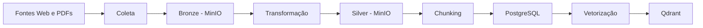

# Banco de Dados para IA Generativa


Projeto desenvolvido no Grupo de Estudos ORION com o objetivo de construir um pipeline completo para coleta, processamento, armazenamento e recuperação de conhecimento utilizando técnicas de Inteligência Artificial Generativa e RAG (Retrieval-Augmented Generation).

---

# Visão Geral

O projeto implementa uma pipeline de dados capaz de:

* Coletar páginas HTML e documentos PDF.
* Armazenar dados brutos em um Data Lake.
* Extrair e transformar conteúdo textual.
* Dividir documentos em chunks.
* Armazenar chunks em banco relacional.
* Gerar embeddings vetoriais.
* Armazenar vetores para busca semântica.
* Servir de base para aplicações de IA Generativa e RAG.

---

# Arquitetura



---

# Tecnologias Utilizadas

## Infraestrutura

* Docker
* Docker Compose
* MinIO

## Coleta

* Bash
* Curl

## Processamento

* Python
* Markdown
* PyPDF

## Armazenamento

* PostgreSQL
* Qdrant
* MinIO

## Inteligência Artificial

* Sentence Transformers
* BAAI/bge-m3

---

# Fluxo da Pipeline

## Bronze

Armazena os dados brutos coletados:

* HTML original das páginas.
* PDFs baixados automaticamente.

## Silver

Armazena os documentos transformados:

* Texto extraído de PDFs.
* Conteúdo HTML convertido para texto.

## Chunking

Os documentos são divididos em:

* Chunks de 1200 caracteres.
* Overlap de 200 caracteres.

## PostgreSQL

Armazena:

* Documento de origem.
* Índice do chunk.
* Tamanho.
* Conteúdo textual.

## Vetorização

Cada chunk é convertido em um embedding utilizando o modelo:

```text
BAAI/bge-m3
```

Cada vetor possui:

```text
1024 dimensões
```

## Qdrant

Armazena:

* Vetores semânticos.
* Metadados dos chunks.

Permite busca vetorial por similaridade de cosseno.

---

# Roadmap

## ✅ Entrega 1 — Coleta e Bronze

* Configuração do MinIO.
* Coleta automatizada via Bash.
* Download de HTML.
* Download automático de PDFs.
* Armazenamento na Bronze.

## ✅ Entrega 2 — Transformação

* Leitura dos objetos da Bronze.
* Extração de texto de PDFs.
* Conversão para texto estruturado.
* Armazenamento na Silver.

## ✅ Entrega 3 — Chunking

* Segmentação dos documentos.
* Overlap entre chunks.
* Persistência dos chunks.

## ✅ Entrega 4 — Persistência

* PostgreSQL para armazenamento textual.
* Criação automática dos registros.

## ✅ Entrega 5 — Vetorização

* Embeddings com BGE-M3.
* Armazenamento vetorial em Qdrant.

---

# Estrutura do Projeto

```text
.
├── coleta.sh
├── coleta_repositorio.sh
├── transformacao.py
├── chunking.py
├── vetorizacao.py
├── pipeline.py
├── Dockerfile
├── docker-compose.yml
├── requirements.txt
├── .env
└── README.md
```

---

# Execução

## Iniciar a infraestrutura

```bash
docker compose up -d
```

## Coletar uma página

```bash
./coleta.sh https://maceio.al.gov.br/p/pgm/concursos
```

## Executar a pipeline completa

```bash
docker compose up
```

A pipeline executará automaticamente:

```text
Coleta
→ Transformação
→ Chunking
→ PostgreSQL
→ Vetorização
→ Qdrant
```

---

# Objetivos de Aprendizagem

* Engenharia de Dados
* Data Lakes
* Processamento de Documentos
* Bancos Relacionais
* Bancos Vetoriais
* Docker
* Embeddings
* Busca Semântica
* RAG (Retrieval-Augmented Generation)

---

# Equipe

Grupo de Estudos ORION

---

# Instituição

Universidade Federal de Alagoas (UFAL)
