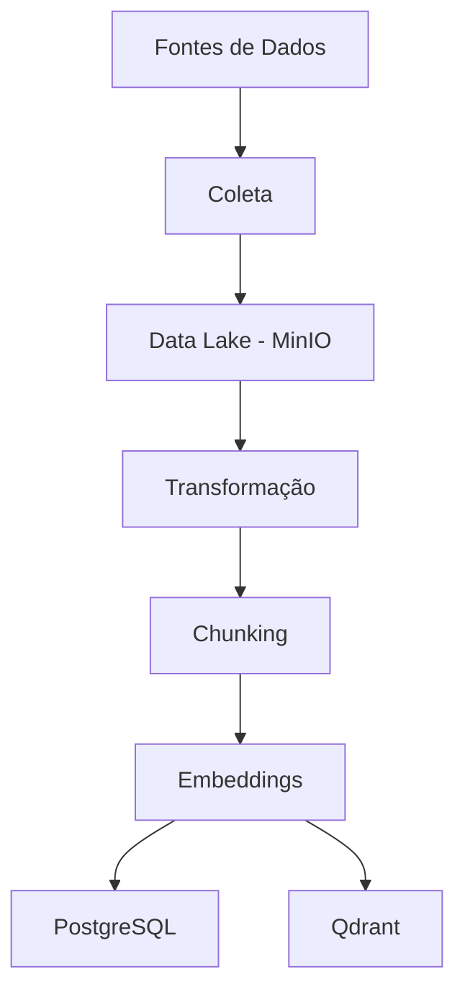

# Banco de Dados para IA Generativa


Projeto desenvolvido no Grupo de Estudos ORION com o objetivo de construir um pipeline completo para coleta, processamento, armazenamento e recuperação de conhecimento utilizando técnicas de Inteligência Artificial Generativa.

---

## Visão Geral

O projeto consiste na construção de uma base de conhecimento capaz de:

* Coletar informações de fontes externas.
* Armazenar dados em um Data Lake.
* Processar e transformar conteúdos.
* Dividir documentos em chunks.
* Gerar embeddings vetoriais.
* Armazenar textos e vetores em bancos especializados.
* Servir de base para aplicações de IA Generativa.

---

## Arquitetura



---

## Tecnologias Utilizadas

### Infraestrutura

* Docker
* MinIO

### Coleta de Dados

* Bash
* Curl

### Processamento

* Python
* Markdown
* Chunking

### Armazenamento

* PostgreSQL
* Qdrant

### Inteligência Artificial

* BGE-M3

---

## Roadmap

### ✅ Entrega 1 — Coleta e Armazenamento Bronze

* Configuração do MinIO com Docker.
* Criação da camada Bronze.
* Automação da coleta utilizando Bash.
* Download de conteúdo web utilizando Curl.
* Armazenamento dos dados brutos no Data Lake.

### 🚧 Entrega 2 — Transformação

* Leitura dos arquivos armazenados.
* Limpeza e tratamento do conteúdo.
* Conversão para texto estruturado.

### ⏳ Entrega 3 — Chunking

* Segmentação de documentos.
* Aplicação de overlap entre chunks.

### ⏳ Entrega 4 — Vetorização

* Geração de embeddings utilizando BGE-M3.

### ⏳ Entrega 5 — Persistência

* Armazenamento textual em PostgreSQL.
* Armazenamento vetorial em Qdrant.

---

## Estrutura do Projeto

```text
.
├── data/
├── docs/
├── scripts/
├── src/
├── docker/
├── README.md
└── .gitignore
```

> A estrutura poderá evoluir conforme novas etapas forem implementadas.

---

## Execução da Primeira Entrega

Iniciar os serviços:

```bash
docker compose up -d
```

Executar a coleta:

```bash
./coleta.sh https://pt.wikipedia.org/wiki/Universidade_Federal_de_Alagoas
```

O conteúdo coletado será armazenado na camada Bronze do Data Lake.

---

## Objetivos de Aprendizagem

* Engenharia de Dados
* Data Lakes
* Automação de processos
* Containers com Docker
* Processamento de documentos
* Bancos relacionais e vetoriais
* IA Generativa e RAG

---

## Equipe

Grupo de Estudos ORION

## Instituição

Universidade Federal de Alagoas (UFAL)
